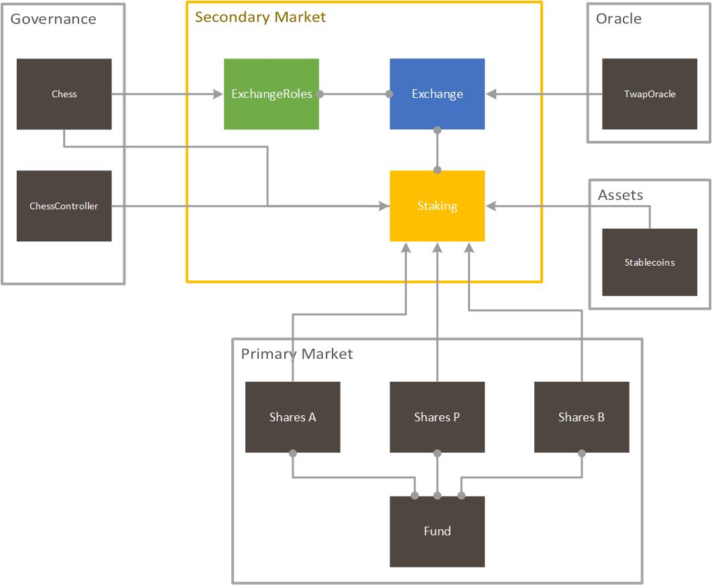
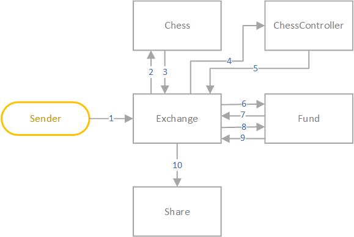
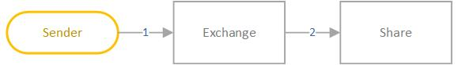
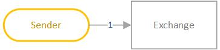
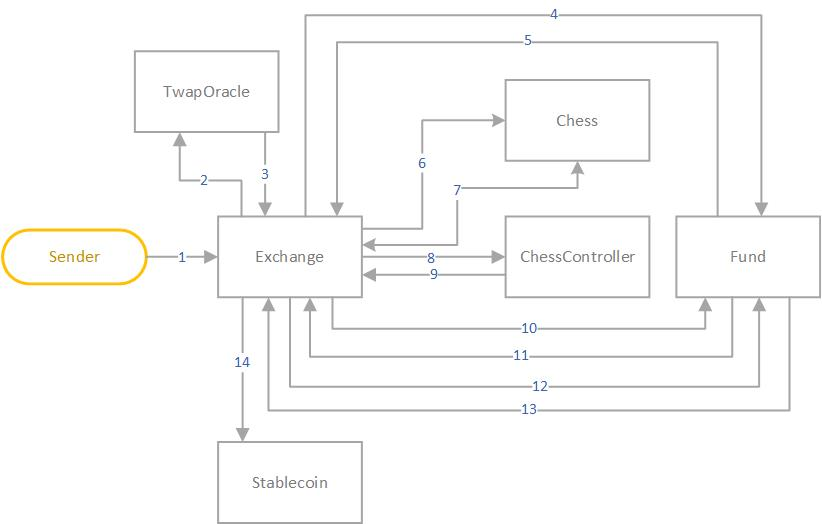
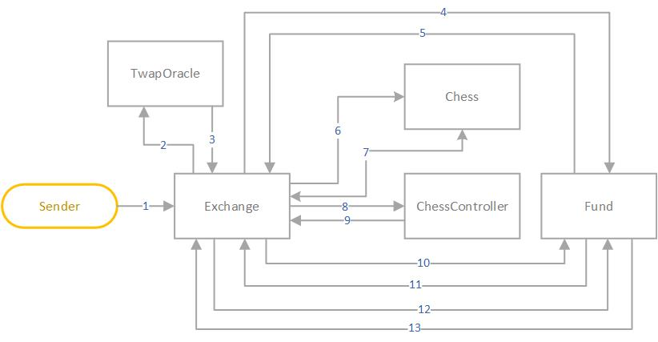
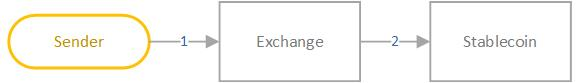
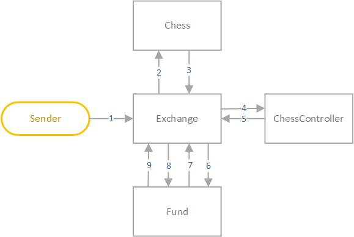

# Tranchess Fund 1.0 specification

## Table of contents

1.  [Architecture](#architecture)
1.  [Contracts](#contracts)
    1.  [Staking](#staking)
    1.  [Exchange](#exchange)
    1.  [ExchangeRoles](#exchange-roles)
1.  [Contract Interactions](#contract-interactions)
    1.  [Deposit/Withdraw](#deposit/withdraw)
    1.  [Placing an order](#placing-an-order)
    1.  [Filling orders](#filling-orders)
    1.  [Cancelling an order](#cancelling-an-order)
    1.  [Settlement](#settlement)
1.  [Contract Methods](#contract-methods)
    1.  [Staking Contract](#staking-contract)
        1.  [deposit](#deposit)
        1.  [withdraw](#withdraw)
    1.  [Exchange Contract](#exchange-contract)
        1.  [placeBid](#placeBid)
        1.  [placeAsk](#placeAsk)
        1.  [buyM](#buyM)
        1.  [sellM](#sellM)
        1.  [cancelBid](#cancelBid)
        1.  [cancelBidByClientOrderID](#cancelBidByClientOrderID)
        1.  [cancelAsk](#cancelAsk)
        1.  [cancelAskByClientOrderID](#cancelAskByClientOrderID)
    1.  [ExchangeRoles Contract](#exchangeroles-contract)
        1.  [applyForMaker](#applyForMaker)

# Architecture

Tranchess Protocol is a platform for crypto-backed synthetic assets capable of speculating, hedging, and arbitraging with minimal liquidation risk, settlement risk, and other systematic risks. In our approach, it consists of two major components: the primary market and the secondary market.

Tranchess Exchange Protocol is the set of contracts representing the secondary market. Since the tokenized shares could experience rebalances, which are essentially linear transformations upon all account balances, no existing swaps or centralized exchanges are readily available for trading shares. As a result, we set off to design our exchange for liquidity. In the secondary market, both the stablecoins such as `USDC` and tokenized shares could be exchanged using a matching mechanism we refer to as **Premium-Discount Orderbook**.

In our approach, trade activities are divided into the same 30-minutes period as the Oracle Protocol, and the exact trading price could not be determined at the trading time, because the price oracles are still subject to change. Instead of a fixed price, the makers need only to specify a certain percentage for an order. The percentage is relative to the net asset values calculated in the future, with a positive percentage known as **Premium** and a negative percentage known as **Discount**. Similar to a traditional exchange order book, the smart contracts also arrange orders in order books from the highest to the lowest percentage forbidding order, and lowest to highest for asking order. We've achieved a few goals with this design:

1. Rebalances do not affect trading activities
1. Low cost for liquidity providers to interact with the blockchain
    1. No impermanent loss, because it is not using AMM
    1. No high-frequency order submission and cancellation, because premiums and discounts fluctuate with the price
1. The exchange operates completely on-chain

<div style="text-align: center;">

</div>

# Contracts

## Staking

The [`Staking`](../contracts/Staking.sol) contract stores tokenized shares and makes them available for exchange and rewards. Each `Staking` corresponds to 1 instance of `Reward`, 1 instance of `Fund`, and thus 3 instances of the `Share` token contract. It accepts deposit or withdraw requests from one of the `Share` token, and accumulates the rewards with the help from `Reward`.

In addition, it keeps the history of the global integral, ∫(rate \* balance / totalSupply dt) from the last rebalance till checkpoint, the most recent per-account integrals, and per-account claimable rewards. It is invoked whenever deposits are changed and accumulate the rewards for the accounts involved.

1. Deposit Token M/A/B
1. Withdraw Token M/A/B
1. Claim rewards

## Exchange

The [`Exchange`](../contracts/Exchange.sol) contract is the main entrance to all secondary market functionalities. Each `Exchange` maintains three pairs of ask and bid order books, facilitates trades, and temporarily holds the stablecoin and tokenized shares before they have been claimed by users.

1. Place bid orders
1. Place ask orders
1. Fill bid orders
1. Fill ask orders
1. Cancel bid order
1. Cancel ask order
1. Settle the pending trades

## Exchange Roles

The [`ExchangeRoles`](../contracts/ExchangeRoles.sol) contract contains the entry rules for maker membership. Since with the correct strategy, makers could gain profits from providing liquidity in Tranchess Exchange, we enforce an exclusive maker membership that requires a substantial amount of vote-locked `Chess` token and expires naturally as the vote-locked `Chess` decreases linearly.

1. Query the status and expiration date of the current maker status
1. Apply for maker

# Contract Interactions

The flowcharts below demonstrate the interactions between either Secondary Market smart contracts, other Tranchess components, or external decentralized applications. The arrow represents execution context from the caller to callee within the EVM as a transaction is processed.

## Deposit/Withdraw

To receive rewards of governance token and participate in the secondary market, one should deposit tokenized shares into the corresponding `Exchange` contract.

### Deposit

<div style="text-align: center;">

</div>

#### Transaction #1

1. Exchange.deposit(tranche, amount)
1. Chess.rate()
1. Chess: (return release rate of `Chess`)
1. ChessController.getFundRelativeWeight(address(this), block.timestamp)
1. ChessController: (return relative weight of this `Staking` contract)
1. Fund.rebalance(totalSupplyM, totalSupplyA, totalSupplyB, version)
1. Fund: (return rebalance result for total supplies)
1. Fund.rebalance(balanceM, balanceA, balanceB, version)
1. Fund: (return rebalance result for available and locked balances)
1. ERC20Token(tranche).transferFrom(account, address(this), amount)

### Withdraw

<div style="text-align: center;">

</div>

#### Transaction #1

1. Exchange.withdraw(tranche, amount)
1. Chess.rate()
1. Chess: (return release rate of `Chess`)
1. ChessController.getFundRelativeWeight(address(this), block.timestamp)
1. ChessController: (return relative weight of this `Staking` contract)
1. Fund.rebalance(totalSupplyM, totalSupplyA, totalSupplyB, version)
1. Fund: (return rebalance result for total supplies)
1. Fund.rebalance(balanceM, balanceA, balanceB, version)
1. Fund: (return rebalance result for available and locked balances)
1. ERC20Token(tranche).transfer(account, amount)

## Placing an order

Bid and ask orders are created by makers to either buy or sell shares of Token M/A/B for the USD stablecoin. For each order placed, the maker is asked to provide the amount, PD level, rebalance version, and a custom order ID of the order. The order book is using a link list implementation and arranges all orders by PD levels (premium-discount level), which is ranged from 0 (-10%) to 80 (-10%) with a step size of 0.25%. Makers are also asked to lock up the equal value of USD stablecoin or shares based on the amount and the PD level of the order.

### Bid order

<div style="text-align: center;">

</div>

#### Transaction #1

1. Exchange.placeBid(tranche, pdLevel, quoteAmount, version, clientOrderID)
1. ERC20Token(stableCoin).transferFrom(maker, address(this), quoteAmount)

### Ask Order

<div style="text-align: center;">

</div>

#### Transaction #1

1. Exchange.placeAsk(tranche, pdLevel, quoteAmount, version, clientOrderID)

## Filling orders

Takers could either buy or sell fund shares by filling one or more maker orders in the Exchange contract. Takers are asked to specify the minimal or maximal PD level they'd accept, the amount of asset willing to trade, and the rebalance version.

### Buying shares

<div style="text-align: center;">

</div>

#### Transaction #1

1. Exchange.buyM(version, maxPDLevel, quoteAmount)
1. TwapOracle.getTwap(timestamp)
1. TwapOracle: (return Twap Oracle)
1. Fund.extrapolateNav(timestamp, price)
1. Fund: (return estimated Nav)
1. Chess.rate()
1. Chess: (return release rate of `Chess`)
1. ChessController.getFundRelativeWeight(address(this), block.timestamp)
1. ChessController: (return relative weight of this `Staking` contract)
1. Fund.rebalance(totalSupplyM, totalSupplyA, totalSupplyB, version)
1. Fund: (return rebalance result for total supplies)
1. Fund.rebalance(balanceM, balanceA, balanceB, version)
1. Fund: (return rebalance result for available and locked balances)
1. ERC20Token(stableCoin).transferFrom(msg.sender, address(this), frozenQuote)

### Selling shares

<div style="text-align: center;">

</div>

#### Transaction #1

1. Exchange.sellM(version, minPDLevel, baseAmount)
1. TwapOracle.getTwap(timestamp)
1. TwapOracle: (return Twap Oracle)
1. Fund.extrapolateNav(timestamp, price)
1. Fund: (return estimated Nav)
1. Chess.rate()
1. Chess: (return release rate of `Chess`)
1. ChessController.getFundRelativeWeight(address(this), block.timestamp)
1. ChessController: (return relative weight of this `Staking` contract)
1. Fund.rebalance(totalSupplyM, totalSupplyA, totalSupplyB, version)
1. Fund: (return rebalance result for total supplies)
1. Fund.rebalance(balanceM, balanceA, balanceB, version)
1. Fund: (return rebalance result for available and locked balances)

## Cancelling an order

Makers could cancel a previous order at any time, even if the account is no longer qualified for maker membership.

### Bid order

<div style="text-align: center;">

</div>

#### Transaction #1

1. Exchange.cancelBid(version, tranche, pdLevel, index)
1. ERC20Token(stableCoin).transfer(makerAddress, order.fillable)

### Ask order

<div style="text-align: center;">

</div>

#### Transaction #1

1. Exchange.cancelAsk(version, tranche, pdLevel, index)
1. Chess.rate()
1. Chess: (return release rate of `Chess`)
1. ChessController.getFundRelativeWeight(address(this), block.timestamp)
1. ChessController: (return relative weight of this `Staking` contract)
1. Fund.rebalance(totalSupplyM, totalSupplyA, totalSupplyB, version)
1. Fund: (return rebalance result for total supplies)
1. Fund.rebalance(balanceM, balanceA, balanceB, version)
1. Fund: (return rebalance result for available and locked balances)

## Settlement

All the matches are stored as pending trades in the exchange protocol, waiting for the settlement. Each individual could call either `settleMaker` or `settleTaker` to clear the pending trades of a specified epoch.

### Settle for maker

<div style="text-align: center;">

</div>

#### Transaction #1

1. Exchange.settleMaker(periodID)
1. TwapOracle.getTwap(timestamp)
1. TwapOracle: (return Twap Oracle)
1. Fund.extrapolateNav(timestamp, price)
1. Fund: (return estimated Nav)
1. Chess.rate()
1. Chess: (return release rate of `Chess`)
1. ChessController.getFundRelativeWeight(address(this), block.timestamp)
1. ChessController: (return relative weight of this `Staking` contract)
1. Fund.rebalance(totalSupplyM, totalSupplyA, totalSupplyB, version)
1. Fund: (return rebalance result for total supplies)
1. Fund.rebalance(balanceM, balanceA, balanceB, version)
1. Fund: (return rebalance result for available and locked balances)
1. ERC20Token(stableCoin).transfer(msg.sender, quoteAmount)

### Settle for taker

<div style="text-align: center;">

</div>

#### Transaction #1

1. Exchange.settleTaker(periodID)
1. TwapOracle.getTwap(timestamp)
1. TwapOracle: (return Twap Oracle)
1. Fund.extrapolateNav(timestamp, price)
1. Fund: (return estimated Nav)
1. Chess.rate()
1. Chess: (return release rate of `Chess`)
1. ChessController.getFundRelativeWeight(address(this), block.timestamp)
1. ChessController: (return relative weight of this `Staking` contract)
1. Fund.rebalance(totalSupplyM, totalSupplyA, totalSupplyB, version)
1. Fund: (return rebalance result for total supplies)
1. Fund.rebalance(balanceM, balanceA, balanceB, version)
1. Fund: (return rebalance result for available and locked balances)
1. ERC20Token(stableCoin).transfer(msg.sender, quoteAmount)

# Contract Methods

## Staking Contract

### deposit

```
/// @dev Deposit to get rewards
/// @param tranche Tranche of the share
/// @param amount The amount to deposit
function deposit(uint256 tranche, uint256 amount) external
```

#### Logic

Calling `deposit` will perform the following steps:

1. Invoke global and per-user reward checkpoint, and rebalance the total supplies and locked/available balances to the latest version
1. Transfer the shares to `Exchange` contract
1. Update the deposit balances and emit `Deposited` event

#### Error

`deposit` may revert with any of the following errors, in addition to any errors specified in the `ERC20`:

| Error          | Condition                  |
| -------------- | -------------------------- |
| NotActiveError | The contract is not active |

### withdraw

```
/// @dev Withdraw
/// @param tranche Tranche of the share
/// @param amount The amount to deposit
function withdraw(uint256 tranche, uint256 amount) external
```

#### Logic

Calling `withdraw` will perform the following steps:

1. Invoke global and per-user reward checkpoint, and rebalance the total supplies and locked/available balances to the latest version
1. Transfer the shares from `Exchange` contract to the account
1. Update the deposit balances and emit `Withdrawn` event

#### Error

`withdraw` may revert with any of the following errors, in addition to any errors specified in the `ERC20`:

| Error          | Condition                  |
| -------------- | -------------------------- |
| NotActiveError | The contract is not active |

## Exchange Contract

### placeBid

```
/// @notice Place a bid order for makers
/// @param tranche Tranche of the base asset
/// @param pdLevel Premium-discount level
/// @param quoteAmount Quote asset amount with 18 decimal places
/// @param version Current rebalance version. Revert if it is not the latest version.
function placeBid(
    uint256 tranche,
    uint256 pdLevel,
    uint256 quoteAmount,
    uint256 version
) external;
```

#### Logic

Calling `placeBid` will perform the following steps:

1. Revert if the amount of tokenzied shares is less than the minimal amount for bid orders
1. Revert if the rebalance version is not the latest
1. Transfer the shares from `makerAddress` to `Exchange` contract
1. Update the bid orderbook and emit a `OrderPlaced` event
1. Update the account's order identifier and emit a `BidOrderPlaced` event

#### Error

`placeBid` may revert with any of the following errors, in addition to any errors specified in the `ERC20`:

| Error                 | Condition                                          |
| --------------------- | -------------------------------------------------- |
| MinimalBidError       | The amount of shares is less than `BID_MIN_AMOUNT` |
| InvalidPDError        | The premium-discount level exceeds the valid range |
| InvalidRebalanceError | The rebalance version is not the latest            |

### placeAsk

```
/// @notice Place an ask order for makers
/// @param tranche Tranche of the base asset
/// @param pdLevel Premium-discount level
/// @param baseAmount Base asset amount
/// @param version Current rebalance version. Revert if it is not the latest version.
function placeAsk(
    uint256 tranche,
    uint256 pdLevel,
    uint256 baseAmount,
    uint256 version
) external;
```

#### Logic

Calling `placeAsk` will perform the following steps:

1. Revert if the amount of USD stablecoin is less than the minimal amount for ask orders
1. Revert if the rebalance version is not the latest
1. Invoke global and per-user reward checkpoint, and rebalance the total supplies and locked/available balances to the latest version
1. Increase the on-hold amount of shares
1. Update the ask orderbook and emit a `OrderPlaced` event
1. Update the account's order identifier and emit a `AskOrderPlaced` event

#### Error

`placeAsk` may revert with any of the following errors:

| Error                 | Condition                                                  |
| --------------------- | ---------------------------------------------------------- |
| MinimalAskError       | The amount of USD stablecoin is less than `ASK_MIN_AMOUNT` |
| InvalidPDError        | The premium-discount level exceeds the valid range         |
| InvalidRebalanceError | The rebalance version is not the latest                    |
| OnHoldOverflowError   | Not enough deposits for placing the order                  |

### buyM

```
/// @notice Buy Token M
/// @param version Current rebalance version. Revert if it is not the latest version.
/// @param maxPDLevel Maximal premium-discount level accepted
/// @param quoteAmount Amount of quote assets (with 18 decimal places) willing to trade
function buyM(
    uint256 version,
    uint256 maxPDLevel,
    uint256 quoteAmount
) external;
```

#### Logic

> Note: the logic behind `buyM`, `buyA` and `buyB` is the same.

Calling `buyM` will perform the following steps:

1. Get the TWAP Oracle from two trading periods ago
1. Estimate the net asset value of M based on the TWAP
1. Loop through the ask orderbook from the highest discount to `pdLevel`:
    1. Loop through the order queue in each pd level:
        1. Skip the order if order creator is no longer qualified for maker
        1. Update the global states of the order queue
        1. Update the maker's pending trades
        1. Invoke global and per-user reward checkpoint, and rebalance the total supplies and locked/available balances to the latest version
        1. Unfreeze and transfer the on-hold amount of shares to `Exchange` contract
        1. Remove the order if maker is completely filled
        1. Go to next order until the taker is completely filled
    1. Update the global states of the ask orderbook
1. Transfer the amount of USD stablecoin frozen for the trade to `Exchange` contract
1. Update the taker's pending trades

#### Error

`buyM` may revert with any of the following errors, in addition to any errors specified in the `ERC20`:

| Error          | Condition                  |
| -------------- | -------------------------- |
| NotActiveError | The contract is not active |

### sellM

```
/// @notice Sell Token M
/// @param version Current rebalance version. Revert if it is not the latest version.
/// @param minPDLevel Minimal premium-discount level accepted
/// @param baseAmount Amount of Token M willing to trade
function sellM(
    uint256 version,
    uint256 minPDLevel,
    uint256 baseAmount
) external;
```

#### Logic

> Note: the logic behind `sellM`, `sellA` and `sellB` is the same.

Calling `sellM` will perform the following steps:

1. Get the TWAP Oracle from two trading periods ago
1. Estimate the net asset value of M based on the TWAP
1. Loop through the bid orderbook from the lowest discount to `pdLevel`:
    1. Loop through the order queue in each pd level:
        1. Skip the order if order creator is no longer qualified for maker
        1. Update the global states of the order queue
        1. Update the maker's pending trades
        1. Remove the order if maker is completely filled
        1. Go to next order until the taker is completely filled
    1. Update the global states of the bid orderbook
1. Transfer the amount of USD stablecoin frozen for the trade to `Exchange` contract
1. Update the taker's pending trades

#### Error

`sellM` may revert with any of the following errors, in addition to any errors specified in the `ERC20`:

| Error          | Condition                  |
| -------------- | -------------------------- |
| NotActiveError | The contract is not active |

### cancelBid

```
/// @notice Cancel a bid order by order identifier
/// @param version Order's rebalance version
/// @param tranche Tranche of the order's base asset
/// @param pdLevel Order's premium-discount level
/// @param index Order's index
function cancelBid(
    uint256 version,
    uint256 tranche,
    uint256 pdLevel,
    uint256 index
) external;
```

#### Logic

Calling `cancelBid` will perform the following steps:

1. Revert if the maker address does not match
1. Remove the order from its order queue
1. Update the global state of the order queue
1. Transfer the locked USD stablecoins from `Exchange` contract to the maker

#### Error

`cancelBid` may revert with any of the following errors, in addition to any errors specified in the `ERC20`:

| Error             | Condition                                          |
| ----------------- | -------------------------------------------------- |
| NotActiveError    | The contract is not active                         |
| InvalidMakerError | The maker address does not match the order's maker |

### cancelAsk

```
/// @notice Cancel an ask order by order identifier
/// @param version Order's rebalance version
/// @param tranche Tranche of the order's base asset
/// @param pdLevel Order's premium-discount level
/// @param index Order's index
function cancelAsk(
    uint256 version,
    uint256 tranche,
    uint256 pdLevel,
    uint256 index
) external;
```

#### Logic

Calling `cancelAsk` will perform the following steps:

1. Revert if the maker address does not match
1. Remove the order from its order queue
1. Update the global state of the order queue
1. Invoke global and per-user reward checkpoint, and rebalance the total supplies and locked/available balances to the latest version
1. Transfer the locked shares from `Exchange` contract to the maker

#### Error

`cancelAsk` may revert with any of the following errors, in addition to any errors specified in the `ERC20`:

| Error             | Condition                                          |
| ----------------- | -------------------------------------------------- |
| NotActiveError    | The contract is not active                         |
| InvalidMakerError | The maker address does not match the order's maker |

## ExchangeRoles Contract

### applyForMaker

```
/// @notice Apply for maker membership
function applyForMaker() external
```

#### Logic

Calling `applyForMaker` will perform the following steps:

1. Get the timestamp of the current vote-locked governance token balance drop below `makerRequirement`
1. Update the maker expiration date
