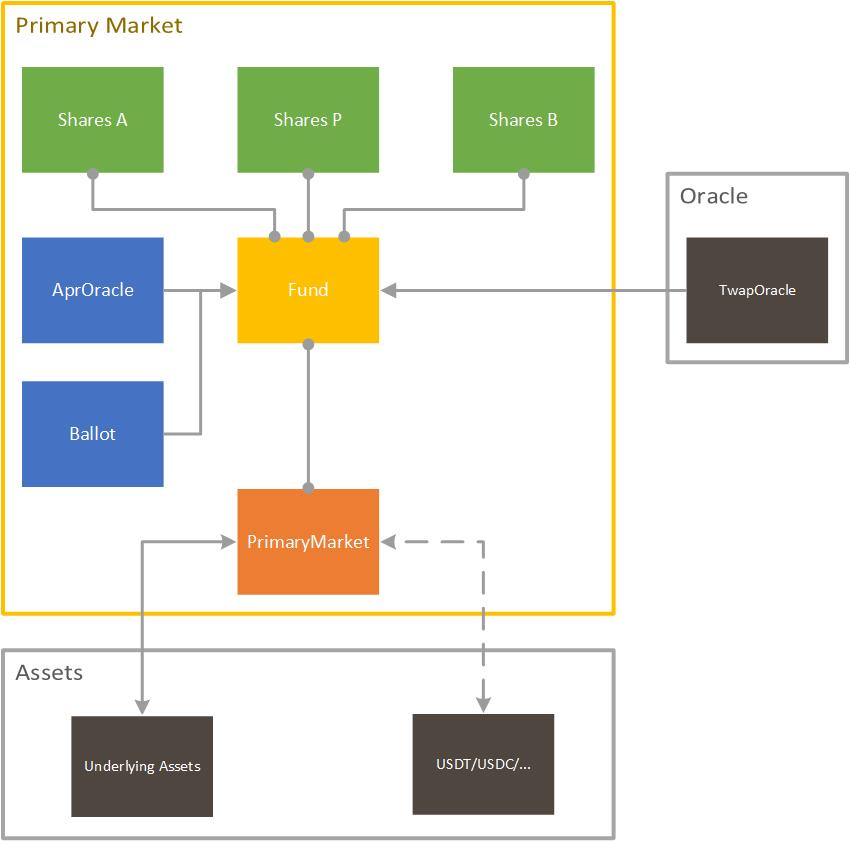
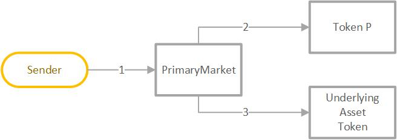
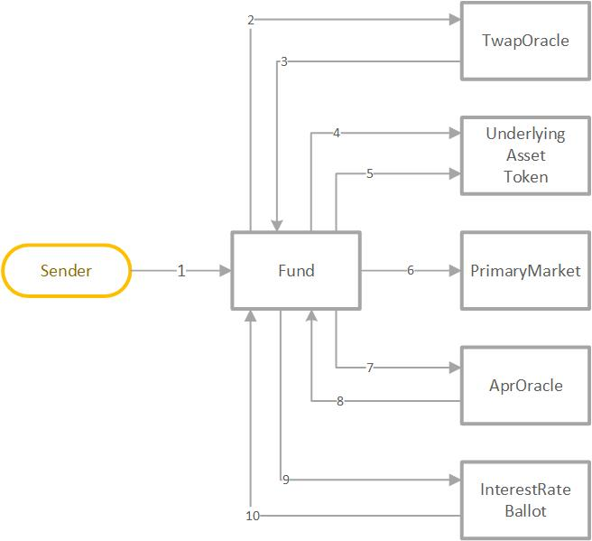

# Tranchess Fund 1.0 specification

## Table of contents

1.  [Architecture](#architecture)
1.  [Contracts](#contracts)
    1.  [Primary Market](#primary-market)
    1.  [Share](#share)
    1.  [Fund](#fund)
    1.  [APR Oracle](#apr-oracle)
    1.  [Interest Rate Ballot](#interest-rate-ballot)
1.  [Contract Interactions](#contract-interactions)
    1.  [Creation/Redemption](#creation/redemption)
    1.  [Split/Merge](#split/merge)
    1.  [Settlement](#settlement)
1.  [Contract Methods](#contract-methods)
    1.  [PrimaryMarket Contract](#primarymarket-contract)
        1.  [create](#create)
        1.  [redeem](#redeem)
        1.  [claim](#claim)
        1.  [split](#split)
        1.  [merge](#merge)
    1.  [Fund Contract](#fund-contract)
        1.  [settle](#settle)

# Architecture

Tranchess Protocol is a platform for crypto-backed synthetic assets capable of speculating, hedging, and arbitraging with minimal liquidation risk, settlement risk, and other systematic risks. In our approach, it consists of two major components: the primary market and the secondary market.

Tranchess Fund Protocol is the set of contracts representing the primary market. In the primary market, the underlying asset could create tokenized shares in the corresponding Master Fund (Token M). Token M could further split into tokenized shares in Tranche A (Token A) and Tranche B (Token B) for different purposes. Holding Token A leads to income with a weekly floating interest rate determined by market performance and governance, whereas holding Token B implies the use of leverages with no liquidation risk and maximal capital efficiency. The Fund would perform periodic evaluation of the net asset values (NAVs) per share, and when one or more of NAVs are over the limitation, it triggers rebalances to universally and proportionally rebases shares across every address.

<div style="text-align: center;">

</div>

# Contracts

## Primary Market

The [`PrimaryMarket`](../contracts/PrimaryMarket.sol) contract is the main entrance to all primary market functionalities. It communicates with `Fund` to process creation\redemption requests, while temporarily manages shares and the underlying asset before they have been claimed by users.

1. Create Token M from the underlying asset: [Creation](#creation)
1. Redeem Token M to the underlying asset: [Redemption](#redemption)
1. Split Token M proportionally to Token A and B: [Split](#split)
1. Merge Token A and B proportionally to Token M: [Merge](#merge)

## Share

The [`Share`](../contracts/Share.sol) contract is the main entrance to all standard ERC20 functionalities for Token M/A/B. For each `Fund`, there would be 3 instances of the `Share` token contract deployed. It communicates with `Fund` to modify balances and total supplies of one of the three tokens.

1. Query the account balances\total supply\allowances
1. Transfer balances
1. Approve for allowances

## Fund

The [`Fund`](../contracts/Fund.sol) contract contains the bulk of the business logic within Tranchess protocol. The `Fund` implements its ingenious NAV calculation and share rebalance logic, which would be invoked daily with public access. The `Fund` is also responsible for storing most of the underlying asset and collects the protocol fee against the underlying asset daily. Although Token M, A, and B are exposed as three independent contracts with ERC20 interfaces, the `Fund` manages all three token balances and total supplies under the hood for smooth rebalances.

1. Mint/Burn/Transfer Token M/A/B
1. Calculate NAVs of Token M/A/B
1. Trigger new rebalance
1. Collect protocol fee
1. Calculate per-account balances/allowances from current rebalance version to the latest version

## APR Oracle

The [`AprOracle`](../contracts/AprOracle.sol) contract provides the on-chain oracle for weekly performance brief of risk-averse DeFi programs such as `Venus` on BSC, or `Aave` and `Compound` on Ethereum. The `Fund` would adopt the average interest rate as the basis for Token A's interest rate.

1. Calculate the average daily interest rate from last week

## Interest Rate Ballot

The [`InterestRateBallot`](../Governance/InterestRateBallot.sol) contract allows `Chess` stakeholders to vote for the floating interest rate of the following week. On top of the result of `AprOracle`, the `Fund` would plus or minus the ballot result for Token A's interest rate.

1. Vote for the floating rate within a given range
1. Calculate the voted interest rate from last week

# Contract Interactions

The flowcharts below demonstrate the interactions between either Primary Market smart contracts, other Tranchess components, or external decentralized applications. The arrow represents execution context from the caller to callee within the EVM as a transaction is processed.

## Creation/Redemption

The primary way to participate in Tranchess Protocol is to create Token M of an underlying asset, or redeem the underlying asset from Token M. Note that all creation and redemption requests are processed at the end of the trading day, and requires a claim operation to retrieve the asset traded.

### Creation

<div style="text-align: center;">

</div>

#### Transaction #1

1. PrimaryMarket.create(underlying)
1. ERC20Token(tokenUnderlying).transferFrom(from, to, underlying)

### Redemption

<div style="text-align: center;">

</div>

#### Transaction #1

1. PrimaryMarket.redeem(shareM)
1. Fund.burn(tokenM, msg.sender, shareM)
1. Fund.mint(tokenM, address(this), shareM)

### Claim

<div style="text-align: center;">

</div>

#### Transaction #1

1. PrimaryMarket.claim()
1. ERC20Token(tokenM).transfer(msg.sender, createdShareM)
1. ERC20Token(tokenUnderlying).transfer(msg.sender, redeemedUnderlying)

## Split/Merge

At any time, token M could transform into token A and B, and vice versa. The ratio between token A and B is currently set to 5:5, but there are infinite numbers of possible combinations. Note that the implication of the A/B ratio is that it actually determines how the gain of Tranche B multiplies, and therefore how much leverage the fund permits; when the ratio is 5:5, the leverage for Tranche B is 2x. Note that unlike Creation/Redemption, Split and Merge are always processed immediately.

### Split

<div style="text-align: center;">

</div>

#### Transaction #1

1. PrimaryMarket.split(shareM)
1. Fund.burn(tokenM, msg.sender, sharesM);
1. Fund.mint(tokenA, msg.sender, sharesA);
1. Fund.mint(tokenB, msg.sender, sharesB);
1. Fund.mint(tokenM, address(this), feeInSharesM);

### Merge

<div style="text-align: center;">

</div>

#### Transaction #1

1. PrimaryMarket.redeem(shareA)
1. Fund.burn(tokenA, msg.sender, shareA);
1. Fund.burn(tokenB, msg.sender, shareB);
1. Fund.mint(tokenM, msg.sender, sharesM);
1. Fund.mint(tokenM, address(this), feeInSharesM);

## Settlement

The protocol checks NAVs daily. For different tranche, the NAV is also calculated differently:

1. NAV of M is the dollar value per share
1. NAV of A is the compounding interest from the previous period
1. NAV of B is the rest of the value after taking out NAV of A from Nav of M

It also triggers a rebalance at the end of a trading day when one of the following conditions is met:

1. NAV of M is more than `Fund.upperThresholdM()`
1. NAV of A is more than `Fund.upperThresholdA()`
1. NAV of B is less than `Fund.lowerThresholdB()`

### Settle

<div style="text-align: center;">

</div>

#### Transaction #1

1. Fund.settle()
1. TwapOracle.getTwap(currentDay)
1. TwapOracle: (return TWAP price)
1. ERC20Token(tokenUnderlying).transfer(PrimaryMarket, deltaUnderlying)
1. ERC20Token(tokenUnderlying).transfer(Governor, fee)
1. PrimaryMarket.settle()
1. AprOracle.capture()
1. AprOracle: (return APR oracle)
1. Ballot.countAndUpdate(previousDay)
1. Ballot: (return averge floating interest rate)

# Contract Methods

## PrimaryMarket Contract

### create

```
/// @dev Create the Tranche M shares from underlying asset.
/// @param underlying The Amount of underlying asset to pay.
function create(uint256 underlying) external;
```

#### Logic

Calling `create` will perform the following steps:

1. Transfer the underlying asset to `PrimaryMarket` contract
1. Rebalance the current state of creation and redemption of the account to the latest version
1. Update the amount of underlying asset waiting for creation
1. Update the total received amount of underlying asset in the current day and emit a `Created` event

#### Error

`create` may revert with any of the following errors, in addition to any errors specified in the `ERC20`:

| Error                | Condition                                                             |
| -------------------- | --------------------------------------------------------------------- |
| MinimalCreationError | The amount of underlying assets is lower than `minCreationUnderlying` |
| NotActiveError       | The contract is not active                                            |

### redeem

```
/// @dev Redeem the Tranche M shares to underlying asset.
/// @param shares The Amount of share M to redeem.
function redeem(uint256 shares) external;
```

#### Logic

Calling `redeem` will perform the following steps:

1. Transfer the amount of token M to `PrimaryMarket` contract
1. Rebalance the current state of creation and redemption of the account to the latest version
1. Update the amount of token M waiting for redemption
1. Update the total received the amount of token M in the current day and emit a `Redeemed` event

#### Error

`redeem` may revert with any of the following errors, in addition to any errors specified in the `ERC20`:

| Error               | Condition                     |
| ------------------- | ----------------------------- |
| ZeroRedemptionError | The amount of token M is zero |
| NotActiveError      | The contract is not active    |

### claim

```
/// @dev Claim the Tranche M shares and underlying asset from previous creation and redemption requests.
function claim() external;
```

#### Logic

Calling `claim` will perform the following steps:

1. Rebalance the current state of creation and redemption of the account to the latest version
1. Transfer the amount of created token M from `PrimaryMarket` contract to the account
1. Transfer the amount of redeemed underlying asset from `PrimaryMarket` contract to the account
1. Reset the amount of token M waiting for redemption and underlying asset waiting for creation to none

#### Error

`claim` may revert with any of the following errors, in addition to any errors specified in the `ERC20`:

| Error          | Condition                  |
| -------------- | -------------------------- |
| NotActiveError | The contract is not active |

### split

```
/// @dev Split the Tranche M shares to Tranche A and B shares.
/// @param inM The Amount of share M to split.
function split(uint256 inM) external;
```

#### Logic

Calling `split` will perform the following steps:

1. Get the current A/B weight ratio
1. Calculate the split fee and the amount of token A and B to mint after the fee
1. Burn `inM` amount of token M
1. Mint the resulting amount of token A and B to the sender
1. Collect the fee in token M to `PrimaryMarket` contract and emit a `Split` event

#### Error

`split` may revert with any of the following errors, in addition to any errors specified in the `ERC20`:

| Error             | Condition                                      |
| ----------------- | ---------------------------------------------- |
| MinimalSplitError | The amount of token M after fee rounds to zero |
| NotActiveError    | The contract is not active                     |

### merge

```
/// @dev Merge Tranche A and B shares to Tranche M shares.
/// @param inA The Amount of share A to merge.
function merge(uint256 inA) external;
```

#### Logic

Calling `merge` will perform the following steps:

1. Get the current A/B weight ratio
1. Calculate the merge fee, the amount of token B to burn, and the amount of token M after the fee
1. Burn `inA` amount of token A and the corresponding amount of token B
1. Mint the resulting amount of token M to the sender
1. Collect the fee in token M to `PrimaryMarket` contract and emit a `Merged` event

#### Error

`merge` may revert with any of the following errors, in addition to any errors specified in the `ERC20`:

| Error             | Condition                                                                      |
| ----------------- | ------------------------------------------------------------------------------ |
| MinimalMergeError | The theoretical amount of token M calculated from share weights rounds to zero |
| NotActiveError    | The contract is not active                                                     |

## Fund Contract

### settle

```
/// @notice Settle the current trading day. Settlement includes the following changes
///         to the fund.
///
///         1. Transfer protocol fee of the day to the governance address.
///         2. Settle all pending creations and redemptions from all primary markets.
///         3. Calculate NAV of the day and trigger rebalance if necessary.
///         4. Capture new interest rate for Share A.
function settle() external
```

#### Logic

Calling `settle` will perform the following steps:

1. Revert if the current day does not end yet
1. Get the TWAP price from `TwapOracle` contract, and revert if the price is not ready yet
1. Collect protocol fee based on current underlying asset stored in `Fund` contract
1. Settle each `PrimaryMarket` contract:
    1. Calculate the amount of token M created in the current day and the total creation fee
    1. Calculate the amount of underlying asset redeemed in the current day and the total redemption fee
    1. Calculate the amount of underlying asset redeemed from split/merge fee in the current day
    1. Approve the fund to take underlying asset if creation is more than the redemption
    1. Fill in the gap if `settle` is not invoked daily
    1. Update the global state in `PrimaryMarket` and emit a `Settled` event
1. Calculate NAVs of token M, A, and B
1. Trigger a rebalance if one of the NAVs exceed the reasonable range
1. Update the global state in `Fund`
1. Update token A's interest rate if at the end of the week
1. Emit a `Settled` event

#### Error

`settle` may revert with any of the following errors, in addition to any errors specified in the `ERC20`:

| Error                   | Condition                                              |
| ----------------------- | ------------------------------------------------------ |
| SettleNotReadyError     | The current trading day is not over yet                |
| TwapNotReadyError       | The underlying asset twap is not available yet         |
| AlreadySettledError     | Settlement has already been called on the current fund |
| InvalidTotalSharesError | Create shares for fund with shares but no underlying   |
| InvalidNavError         | Create shares at zero NAV                              |

## InterestRateBallot Contract

### castVote

#### Logic

Calling `castVote` will perform the following steps:

1. Revert if the option number is invalid
1. Revert if the voter has already voted in the current voting period
1. Get the veChess balance of the voter at the end of the current voting period
1. Update the vote counts of the selected option and global state
1. Emit a `VoteCast` event

#### Error

`castVote` may revert with any of the following errors:

| Error              | Condition                                                    |
| ------------------ | ------------------------------------------------------------ |
| InvalidOptionError | The option exceed the ranges for selection                   |
| AlreadyVotedError  | The voter has already voted the in the current voting period |
