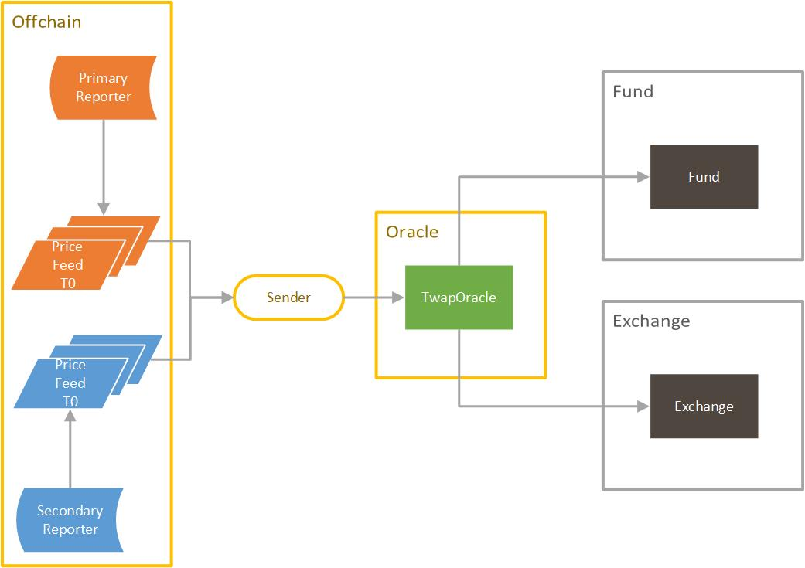

# Tranchess Fund 1.0 specification

## Table of contents

1.  [Architecture](#architecture)
1.  [Contracts](#contracts)
    1.  [TWAP Oracle](#twap-oracle)
1.  [Contract Methods](#contract-methods)
    1.  [updateTwapFromPrimary](#updateTwapFromPrimary)
    1.  [updateTwapFromSecondary](#updateTwapFromSecondary)
    1.  [updateTwapFromOwner](#updateTwapFromOwner)
    1.  [getTwap](#getTwap)
1.  [Miscellaneous](#miscellaneous)
    1.  [Offchain Data Collection](#offchain-data-collection)
    1.  [Reporter Reliability](#reporter-reliability)
    1.  [Gas Cost](#gas-cost)

# Architecture

Tranchess Protocol is a platform for crypto-backed synthetic assets capable of speculating, hedging, and arbitraging with minimal liquidation risk, settlement risk, and other systematic risks. In our approach, it consists of two major components: the primary market and the secondary market.

Tranchess Oracle Protocol is the set of smart contracts that collect and calculate time-weighted average prices of a given asset from off-chain data sources in an epoch. The signature verification is built on top of Compound's [Open Oracle Protocol](https://github.com/compound-finance/open-oracle). In the current configuration, the batch size of messages in an epoch is 30 with a 1-minute interval between, and as a result, an epoch is 30-minute long.

<div style="text-align: center;">

</div>

# Contracts

## TWAP Oracle

The [`TwapOracle`](../contracts/oracle/TwapOracle.sol) contract is the entrance to TWAP Oracle functionalities. It verifies and collects data from trusted reporters, while calculates the average price every epoch.

1. Update the latest TWAP from the primary reporter: [Primary Reporter](#updateTwapFromPrimary)
1. Update the latest TWAP from the secondary reporter: [Secondary Reporter](#updateTwapFromSecondary)
1. Update the latest TWAP from the contract owner: [Contract Owner](#updateTwapFromOwner)
1. Get the TWAP of an epoch

# Contract Methods

### updateTwapFromPrimary

```
/// @notice Submit prices in a epoch that are signed by the primary source.
/// @param timestamp End timestamp in seconds of the epoch
/// @param priceList A list of prices (6 decimal places) in messages signed by the source,
///        with zero indicating a missing message
/// @param rList A list of "r" values of signatures
/// @param sList A list of "s" values of signatures
/// @param packedV "v" values of signatures packed in a single word,
///        starting from the lowest byte
function updateTwapFromPrimary(
    uint256 timestamp,
    uint256[MESSAGE_BATCH_SIZE] calldata priceList,
    bytes32[MESSAGE_BATCH_SIZE] calldata rList,
    bytes32[MESSAGE_BATCH_SIZE] calldata sList,
    uint256 packedV
) external
```

#### Logic

Calling `updateTwapFromPrimary` will perform the following steps:

1. Revert if too late for the primary reporter to update an existing TWAP
1. Revert if the timestamp is not the exact end timestamp of an epoch
1. Iteratively validate each message and update the count and weighted sum.
1. Revert if the new message count is less or equal than the current message count
1. Update the TWAP price and message count of the epoch, and emit an `Update` event.

#### Error

`updateTwapFromPrimary` may revert with any of the following errors:

| Error                     | Condition                                                                    |
| ------------------------- | ---------------------------------------------------------------------------- |
| TooLatePrimaryError       | The timestamp is too late for the primary source to update an existing epoch |
| InvalidTimestampError     | The supplied timestamp is not at the exact end of any epoch                  |
| MissingMessagesError      | There are too many adjacent messages missing                                 |
| InvalidSignatureError     | The signature could not be verified                                          |
| MoreMessagesRequiredError | More messages are required to update an existing epoch                       |

### updateTwapFromSecondary

```
/// @notice Submit prices in a epoch that are signed by the secondary source.
///         This is allowed only after SECONDARY_SOURCE_DELAY has elapsed after the epoch.
/// @param timestamp End timestamp in seconds of the epoch
/// @param priceList A list of prices (6 decimal places) in messages signed by the source,
///        with zero indicating a missing message
/// @param rList A list of "r" values of signatures
/// @param sList A list of "s" values of signatures
/// @param packedV "v" values of signatures packed in a single word,
///        starting from the lowest byte
function updateTwapFromSecondary(
    uint256 timestamp,
    uint256[MESSAGE_BATCH_SIZE] calldata priceList,
    bytes32[MESSAGE_BATCH_SIZE] calldata rList,
    bytes32[MESSAGE_BATCH_SIZE] calldata sList,
    uint256 packedV
) external
```

#### Logic

Calling `updateTwapFromSecondary` will perform the following steps:

1. Revert if the contract is only accepting data from the primary reporter
1. Revert if updating epoch before the oracle is deployed
1. Revert if too late for the secondary reporter to update an existing TWAP
1. Revert if the timestamp is not the exact end timestamp of an epoch
1. Iteratively validate each message and update the count and weighted sum.
1. Revert if the new message count is less or equal than the current message count
1. Update the TWAP price, timestamp, and message count of the epoch, and emit an `Update` event.

#### Error

`updateTwapFromSecondary` may revert with any of the following errors:

| Error                     | Condition                                                                      |
| ------------------------- | ------------------------------------------------------------------------------ |
| NotReadySecondaryError    | Not ready for the secondary source                                             |
| TooEarlySecondaryError    | The secondary source cannot update epoch before the oracle is deployed         |
| TooLateSecondaryError     | The timestamp is too late for the secondary source to update an existing epoch |
| InvalidTimestampError     | The supplied timestamp is not at the exact end of any epoch                    |
| MissingMessagesError      | There are too many adjacent messages missing                                   |
| InvalidSignatureError     | The signature could not be verified                                            |
| MoreMessagesRequiredError | More messages are required to update an existing epoch                         |

### updateTwapFromOwner

```
/// @notice Submit a TWAP with 18 decimal places by the owner.
///         This is allowed only when a epoch gets no update after OWNER_DELAY has elapsed.
function updateTwapFromOwner(uint256 timestamp, uint256 price) external onlyOwner
```

#### Logic

Calling `updateTwapFromOwner` will perform the following steps:

1. Revert if the timestamp is not the exact end timestamp of an epoch
1. Revert if the contract is only accepting data from the primary and secondary reporters
1. Revert if updating an existing TWAP
1. Revert if updating epoch before the oracle is deployed
1. Revert if the epoch is not following an updated epoch
1. Revert if the price deviates too much from the last price
1. Update the TWAP price of the epoch, and emit an `Update` event.

#### Error

`claim` may revert with any of the following errors, in addition to any errors specified in the `ERC20`:

| Error                 | Condition                                                          |
| --------------------- | ------------------------------------------------------------------ |
| InvalidTimestampError | The supplied timestamp is not at the exact end of any epoch        |
| NotReadyOwnerError    | Not ready for the owner                                            |
| PriceExistedError     | Cannot update an existing epoch                                    |
| TooEarlyOwnerError    | The owner source cannot update epoch before the oracle is deployed |
| PriceMissingError     | Update a epoch following an not-yet-updated epoch                  |
| PriceFluctuatedError  | Owner price deviates too much from the last price                  |

### getTwap

```
/// @notice Return TWAP with 18 decimal places in the epoch ending at the specified timestamp.
///         Zero is returned if the epoch is not initialized yet or can still be updated
///         with more messages from the same source.
/// @param timestamp End Timestamp in seconds of the epoch
/// @return TWAP (18 decimal places) in the epoch, or zero if the epoch is not initialized yet
///         or can still be updated with more messages from the same source.
function getTwap(uint256 timestamp) public view override returns (uint256)
```

#### Logic

Calling `getTwap` will perform the following steps:

1. Return 0 if:
    1. The price has not been updated yet
    1. The price can still be updated by more messages from the primary source
    1. The price comes from the secondary source and can still be updated by more messages from that source
1. Return the price of the timestamp

# Miscellaneous

## Offchain Data Collection

A significant portion of this protocol is off-chain data collection by agents subscribing to price feeds published by either Coinbase or OKEx. Agents are expected to record the data points minute by minute and invoke the public contract methods to submit them once every 30 minutes.

The signature of each message should prevent malicious agents from twisting the TWAP to any extreme values, but it is still possible for agents to gain an advantage by deliberately excluding some of the data points. As a result, the protocol allows data with better quality to be re-submitted in a limited timeframe before making it official.

## Reporter Reliability

Two reporters we currently adopt are [Coinbase](https://www.coinbase.com/) and [OKEx](https://www.okex.com/), with Coinbase being our primary reporter and OKEx being the secondary. Both centralized exchanges have relatively more liquid markets and are among few that publicly support [Open Oracle Protocol](https://github.com/compound-finance/open-oracle). With empirical data, the price feeds could suffer from hiccups once in a while, resulting in missing data points during TWAP calculation. To make the oracle more robust,

1. The contract interpolates the missing point
1. Again, the data with better quality could be re-submitted in a limited timeframe before making it official

## Gas Cost

Maintaining the Oracle Protocol would require relatively more frequent on-chain operations, as a batch of 20-30 messages and signatures would be submitted to the smart contract every 30 minutes. To minimize gas usage,

1. Only prices are passed to the contract, and later encoded to messages within the contract
1. Split signatures to lists of r, s, and v before passing to the contract
1. All in-memory operations within loops
